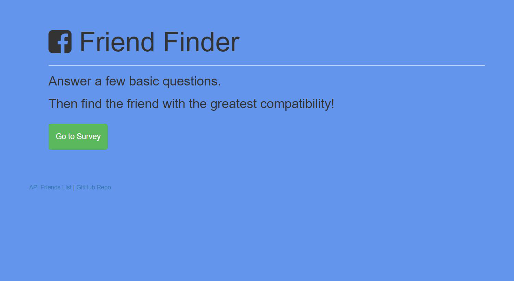
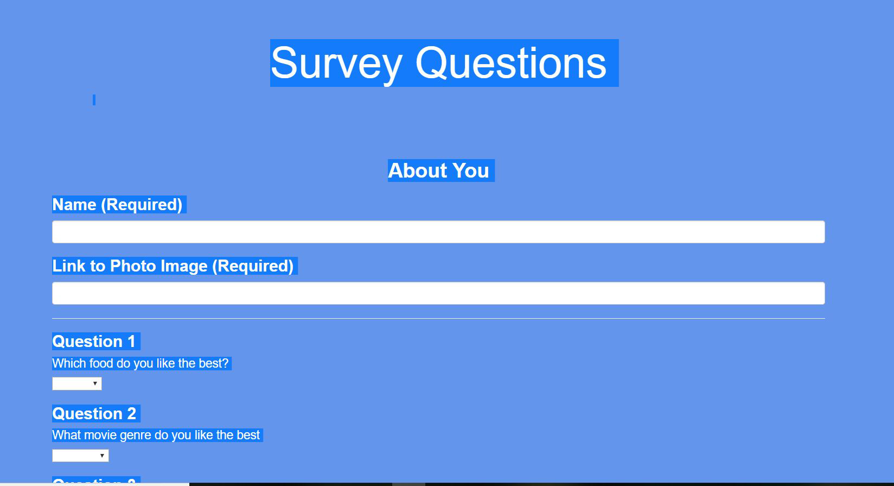
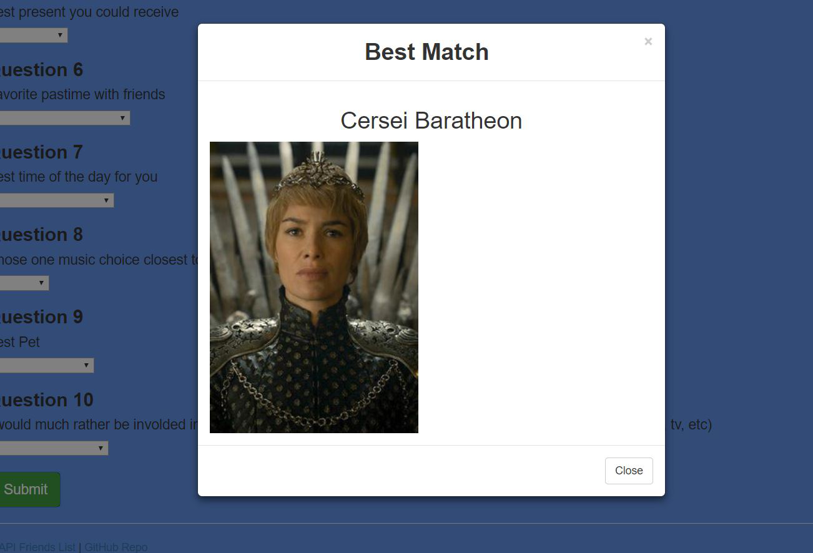

 <h1 align="center"> Friend Finder</h1>
 <h2 align="center">
 GT Coding Bootcamp Homework #11 
 Todd Williams 
<a href="https://friendfinder018.herokuapp.com/">Heroku Web Address</a>
</h2> 
<h3> For homework number 11 the were instructed to create an aplication that would include an home page and a survey page where the user would answer a series of questions abd submit to the application.  The backgroung logic would then pull in from the firends.js file the list of current users and compare the answers of everyone to the current user submision.  The user would then be returned a modal pop-up that would display the name and saved image of that person.  I accomplished this by adding the scores (1-5) of each user and comparing that to the total of the current user and returning the saved user with the lowest total difference. Finally this was the first application that required the deployment to Heroku

Some of the technologies used in the creation of the application include:
<ul>
    <li>HTML/CSS</li>
    <li>javascript and jQuery</li>
    <li>js.Node and the NPM</li>
    <li>Express Server Manager</li>
    <li>JSON calls both GET and PUSH</li>
    <li>Heroku web hosting service</li>
</ul>
</h3>
<h2>
A few screenshots from the application to describe functionality.
</h2>
<h3>
First the homepage: 
 
Now the survey Page: 
 
And then modal return of best user: 

</h3>